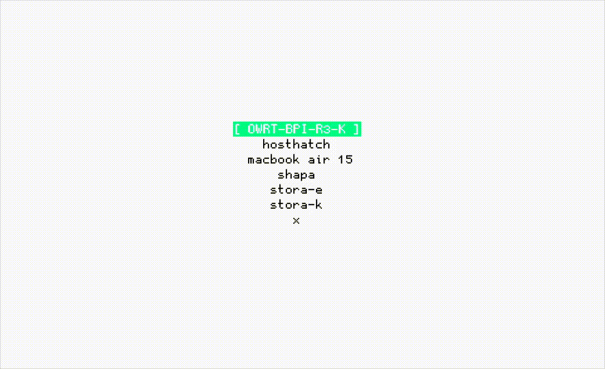

# SSHS: Simple SSH Launcher Menu

SSHS is a **simple SSH launcher menu** that allows you to quickly and easily connect to multiple servers with a single click. It simplifies the process of managing SSH connections by automating authentication and replacing the need for manual SSH commands.

## Features

1. **Server List Management**: Easily manage a list of servers with their respective connection parameters (IP address, port, username, and password or SSH keys).
   
2. **One-Click Connection**: Select a server from the list, and SSHS will automatically connect via SSH without needing to type commands manually.

3. **Supports Passwords and SSH Keys**: Works with both standard passwords and SSH keys, including passphrase-protected SSH keys.

4. **Replaces ssh-agent and sshpass**: SSHS provides automated password entry for SSH keys and standard passwords, eliminating the need for tools like `ssh-agent` (used to store SSH keys in memory) and `sshpass` (used for automatic password input). SSHS handles this internally for a fully automated authentication process.

5. **Automated Password Input**: The program detects prompts for password or passphrase input and automatically provides the necessary information, speeding up the connection process.

6. **Pty Support**: The program uses a pseudo-terminal (PTY) to emulate interactive terminal behavior, just like a regular SSH connection.

7. **Shell Command Flexibility**: SSHS can use different shell environments (defaulting to Bash), allowing flexibility for different server environments.

8. **Signal Handling and Session Management**: SSHS monitors terminal resize events and ensures proper session termination when the user disconnects.

## Why Use SSHS?

SSHS offers a streamlined and efficient alternative to using tools like `ssh-agent` and `sshpass` for automating SSH connections. With one-click connection support and automated password handling, it simplifies server management for system administrators, developers, and DevOps professionals who frequently interact with multiple remote hosts.

### Key Benefits:

- **Efficiency**: No need to manually type passwords or manage SSH key agents. SSHS automates these tasks.
- **Convenience**: Quickly connect to servers without repetitive setup steps.
- **Security**: Supports both password-based and key-based authentication with automated passphrase entry.

## License

This project is licensed under the MIT License - see the [LICENSE](LICENSE) file for details.
